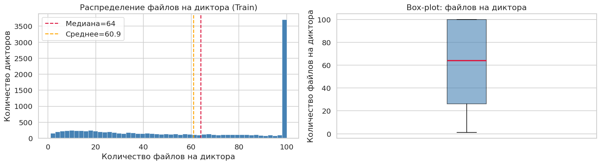
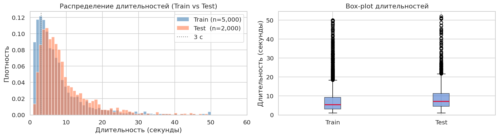
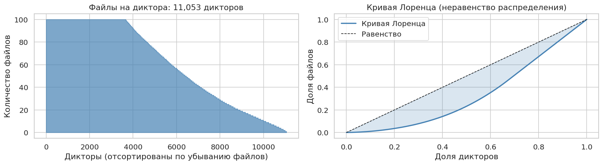
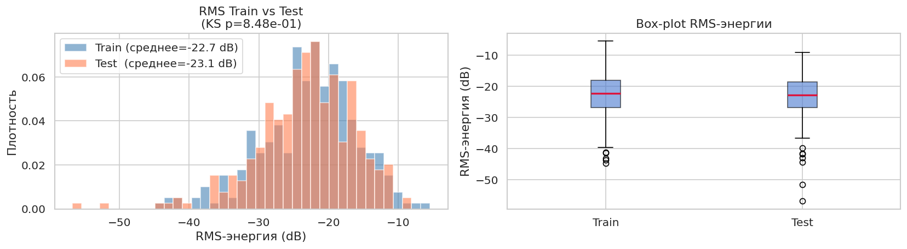
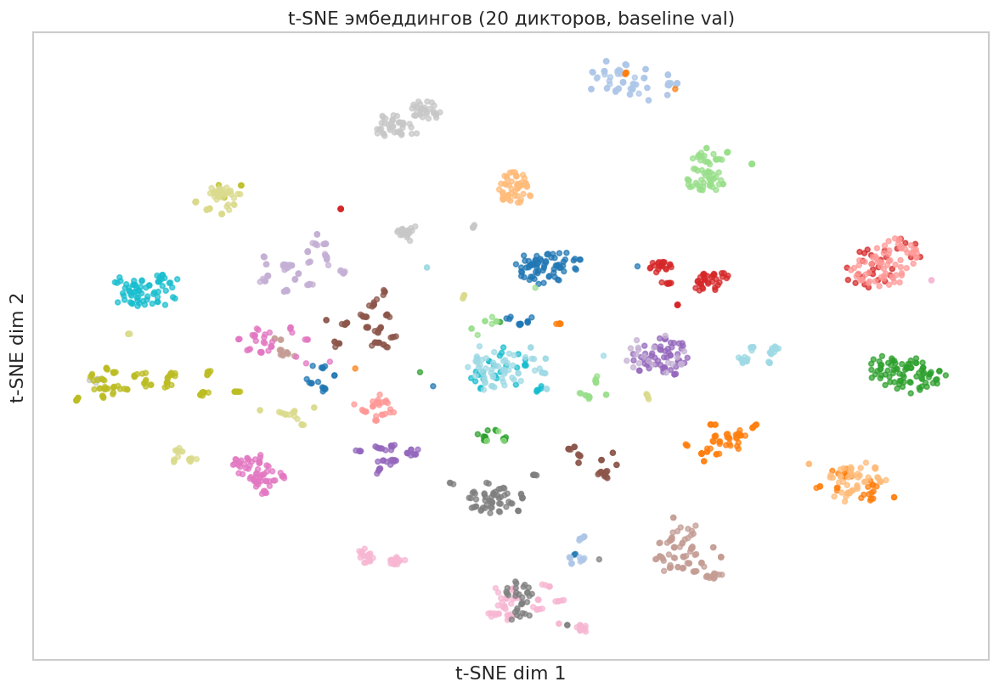
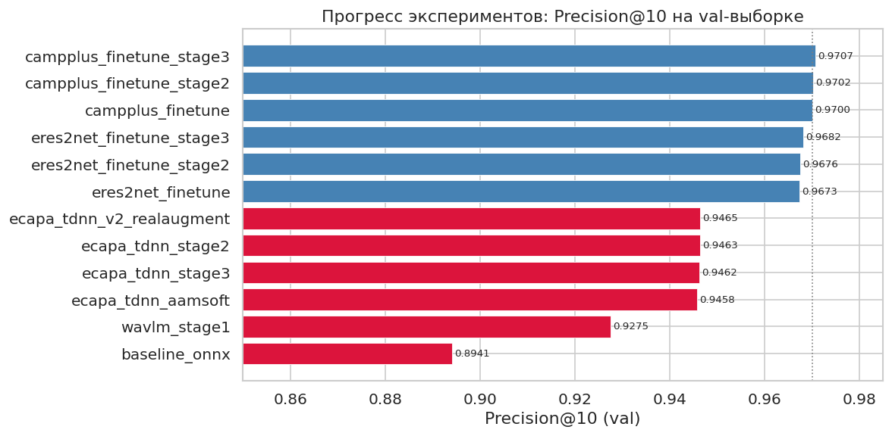

# Отчёт по решению - Криптонит: Тембр
**Команда:** AI Amigos
**Итоговый результат (public):** 0.7439 

---

## 1. Краткое описание задачи и протокола

Задача - **speaker retrieval**: для каждой из 134 697 тестовых аудиозаписей (FLAC, 16 kHz) найти 10 наиболее похожих по голосу записей из того же тестового набора. Качество оценивается метрикой **Precision@10** - доля соседей из топ-10, принадлежащих тому же говорящему. Метки говорящих в тестовом наборе скрыты; у каждого говорящего гарантировано не менее 11 записей.

Ключевая сложность: тестовые записи содержат реальные искажения - шум, реверберацию, far-field, телефонные кодеки. Это приводит к «расползанию» эмбеддингов одного говорящего в пространстве признаков, из-за чего наивный поиск по косинусному сходству ошибается.

---

## 2. EDA и наблюдения по данным

**Обучающая выборка:** 673 277 аудиофайлов, 11 053 говорящих. Медианное количество файлов на говорящего - 64, диапазон от 1 до 100 - относительно равномерное распределение без сильного дисбаланса.

**Ключевые наблюдения:**

- Тренировочные данные - **чистый звук**. Аудио записано в контролируемых условиях без значимого шума или реверберации. Это создаёт критический разрыв домена с тестовым набором.

- Тестовые данные содержат **реальные искажения**: записи в шумных помещениях, far-field микрофоны, телефонные кодеки, реверберация. Это подтвердилось первым же сабмитом: модель, обученная без реальных аугментаций, упала с val P@10=0.9458 до public P@10=0.2699.

- **Вывод для обучения:** необходимо агрессивно имитировать тестовые условия через аугментации. Синтетический белый/розовый шум не даёт достаточного покрытия - нужны реальные RIR-файлы (акустические импульсные характеристики помещений) и реальные шумовые файлы (MUSAN).

- Длина записей варьируется. Фиксированный 3-секундный кроп с нормализацией амплитуды - разумный компромисс между покрытием информации и скоростью обучения. TTA (Test-Time Augmentation) с несколькими кропами помогает усреднить нестабильность коротких сегментов.

---

## 3. Baseline и отправная точка

Организаторамы был предоставлен baseline - **ECAPA-TDNN**, дающий val P@10=0.8941 на локальном сплите (500 говорящих из train).

В качестве первой собственной точки мы обучили ECAPA-TDNN с нуля (30 эпох, val P@10=0.9458). **Public результат - 0.2699**, что оказалось катастрофически хуже ожидаемого. Это стало ключевым диагностическим экспериментом: проблема не в архитектуре, а в полном отсутствии реалистичных аугментаций.

---

## 4. Подход и модель

### 4.1 Выбор архитектур

После диагностики провала мы сместились на **предобученные модели с открытых датасетов**, которые уже видели разнообразные условия записи:

- **CAM++** (`damo/speech_campplus_sv_en_voxceleb_16k`, Alibaba DAMO) - лёгкий и эффективный энкодер на основе TDNN с multi-scale агрегацией. Zero-shot: 0.4560.
- **ERes2Net** (`damo/speech_eres2net_sv_en_voxceleb_16k`, Alibaba DAMO) - усиленный Res2Net с расширенными рецептивными полями. Zero-shot: 0.4896.

Обе модели обучены на VoxCeleb1+2 (~7000 говорящих, разные сессии и акустические условия), что объясняет их изначальную устойчивость к искажениям.

### 4.2 Fine-tuning

Дообучение проводилось в **три стадии** с убывающим learning rate:

- **Stage1** (lr=1e-4, 10 эпох): замороженный backbone у ERes2NetV2, у остальных - полная модель. Быстрый рост P@10.
- **Stage2** (lr=1e-5, 5 эпох): продолжение с меньшим шагом.
- **Stage3** (lr=5e-6, 10 эпох): точная донастройка, минимальный прирост но стабильный.

**Loss: SubcenterArcFace** (K=3, margin=0.2, scale=30) - модификация ArcFace с несколькими подцентрами на класс. Это делает границы между говорящими более гибкими и улучшает устойчивость к внутриклассовой вариативности (разные условия записи одного говорящего).

### 4.3 Аугментации при fine-tuning

Ключевым инженерным решением стал набор **реалистичных аугментаций**, имитирующих тестовые условия:

- **MUSAN noise** (930 реальных шумовых файлов, p=0.5): случайный файл наклядывается на речь с заданным SNR 0–15 dB. В отличие от синтетического белого шума, MUSAN содержит реальные фоновые звуки, музыку и разговорный шум.
- **RIR реверберация** (60k файлов OpenSLR, p=0.6): свёртка речи с реальной акустической характеристикой помещения. Имитирует far-field и записи в различных помещениях.
- **Телефонный канал** (p=0.3): bandpass-фильтр 300–3400 Hz + ресемплинг до 8 кГц и обратно.
- **MP3-компрессия** (p=0.2): кодирование с низким битрейтом через ffmpeg.
- **Speed perturbation** (p=0.3): изменение скорости ×0.9/1.1 без изменения высоты тона.
- **Volume jitter** (p=0.5): случайное усиление ±6 dB.

Аугментации применяются **на лету** к каждому 3-секундному кропу - модель видит разные комбинации искажений на каждой итерации.

---

## 5. История сабмитов и прогресс метрики

### 5.1 Итоговая таблица сабмитов

| # | Описание | Public P@10 | Δ к пред. | Ключевой вывод |
|---|---|---|---|---|
| 1 | ECAPA-TDNN с нуля, синт. аугментации | 0.2699 | - | Провал из-за отсутствия реальных шумов |
| 2 | SpeechBrain ECAPA zero-shot (VoxCeleb) | 0.3858 | +0.116 | Предобученные модели > обучение с нуля |
| 3 | WavLM-Base-Plus zero-shot | 0.1149 | −0.271 | Баг attention_mask, исправлен |
| 4 | CAM++ zero-shot (Alibaba DAMO) | 0.4560 | +0.070 | Более сильная предобученная модель |
| 5 | ERes2Net zero-shot (Alibaba DAMO) | 0.4896 | +0.034 | Разные архитектуры дают разные сигналы |
| 6 | CAM++ 70% + ECAPA v2 30%, ансамбль | 0.4776 | −0.012 | Слабый компонент тянет ансамбль вниз |
| 7 | Fine-tuned CAM++ solo (MUSAN+RIR) | 0.6040 | **+0.148** | Крупнейший прирост - реальные аугментации |
| 8 | FT-CAM++ 70% + ERes2Net 30% | 0.6125 | +0.009 | Ансамбль двух разных архитектур работает |
| 9 | FT-CAM++ 60% + FT-ERes2Net 40% + Rerank(k1=20) | 0.7208 | **+0.108** | K-reciprocal rerank - второй крупный скачок |
| 10 | TTA5 stage1: CAM++ 60% + ERes2Net 40% + Rerank(k1=70) | 0.7388 | +0.018 | Больший k1 и TTA3→5 |
| 11 | TTA5 stage3: CAM++ 60% + ERes2Net 40% + Rerank(k1=70) | 0.7413 | +0.003 | Stage3 fine-tune даёт небольшой прирост |
| 12 | TTA10 stage3: CAM++ 60% + ERes2Net 40% + Rerank(k1=70) | 0.7427 | +0.001 | TTA3→10 небольшой прирост |
| 13 | TTA10 stage3: CAM++ 55% + ERes2Net 45% + Rerank(k1=70, λ=0.1) | **0.7439** | **+0.001** | Оптимум alpha и lambda |
| 14 | + WavLM Large stage2 TTA5 (γ=0.05) | 0.7434 | −0.001 | WavLM недообучен, тянет вниз |
| 15 | ERes2NetV2 stage1 55% + CAM++ 45% | 0.7310 | −0.013 | Frozen backbone слабее полного FT |

### 5.2 Вклад каждого подхода в итоговую метрику

| Подход | Прирост P@10 | Характер |
|---|---|---|
| Переход на предобученные модели (zero-shot) | +0.224 (0.2699→0.4896) | Фундаментальный |
| Fine-tuning с реальными аугментациями (MUSAN+RIR) | **+0.148** | Крупнейший одиночный буст |
| K-reciprocal re-ranking (k1=70, λ=0.1) | **+0.108** | Постпроцессинг без переобучения |
| Ансамбль двух архитектур | +0.009–0.015 | Стабильный прирост |
| Stage2+3 fine-tuning (убывающий LR) | +0.003–0.005 | Постепенное улучшение |
| TTA 3→10 кропов | +0.002–0.003 | Стабилизация эмбеддингов |
| Alpha-tuning (60/40 → 55/45) | +0.001 | Финальная оптимизация |

### 5.3 Что не дало прироста

| Подход | Результат | Причина провала |
|---|---|---|
| ECAPA-TDNN как 3-я модель в ансамбле | −0.001–0.003 | Слабее пары, добавляет шум |
| TTA 10→20 кропов | 0.000 | Плато стабилизации |
| WavLM Large в ансамбле | −0.003 | Solo WavLM=0.5947, недообучен |
| Verifier/cross-encoder reranker | −0.077 | Domain mismatch: тестовые говорящие не видены при обучении |
| Graph-based re-ranking (эвристики) | −0.007..−0.015 | K-reciprocal уже оптимален на k1=70 |
| ERes2NetV2 stage1 frozen | −0.013 | Frozen backbone не конкурирует с полным FT ERes2Net |

---

## 6. Эксперименты и сравнения

### 6.1 Zero-shot vs Fine-tuning

Zero-shot эксперименты подтвердили, что сильная предобученная модель (ERes2Net: 0.4896) превосходит ECAPA-TDNN, обученный нами с нуля (0.2699). Fine-tuning CAM++ на данных соревнования с реальными аугментациями дал скачок **+0.148** к zero-shot - самый большой прирост за все эксперименты.

### 6.2 Ансамбль эмбеддингов

Конкатенация L2-нормализованных эмбеддингов двух разных архитектур в единый вектор повышенной размерности (704-dim) стабильно улучшала результат по сравнению с каждой моделью в отдельности. Оптимальный вес найден перебором: **55% CAM++ + 45% ERes2Net**.

Попытка добавить ECAPA-TDNN третьей моделью в ансамбль не дала прироста - архитектура слабее пары и добавляла шум в пространство эмбеддингов.

WavLM Large (файнтюн на наших данных) также не улучшил ансамбль, хотя показывал val P@10=0.9547. Причина - недообученность: solo WavLM дал лишь 0.5947 на тесте, что тянуло ансамбль вниз. Дальнейшие стадии обучения WavLM не вписывались в сроки.

### 6.3 K-reciprocal re-ranking

Наиболее значимое улучшение после fine-tuning дал **k-reciprocal re-ranking** (алгоритм Zhong et al., CVPR 2017). Идея: если запись A похожа на B, но B не считает A похожей на себя - скорее всего это ложное совпадение. Взаимно подтверждённые пары получают более высокий итоговый score.

Перебор параметров показал оптимум: **k1=70, k2=6, λ=0.1**. Больший k1 (70 вместо стандартных 20) позволяет учитывать более широкое окружение, что особенно важно при зашумлённых эмбеддингах.

### 6.4 Test-Time Augmentation (TTA)

Усреднение эмбеддингов по нескольким кропам одной записи (разные позиции в аудио) стабилизирует представление. Оптимальное число кропов - **10**: увеличение до 20 не давало прироста.

### 6.5 Что не сработало

- **Verifier/cross-encoder**: попытка обучить парный классификатор для переранжирования пар (emb1, emb2) → вероятность того же говорящего. Подход не работает для данной задачи: тестовые говорящие не пересекаются с тренировочными, а косинусное сходство уже является оптимальным сигналом для ненаблюдаемых классов.
- **Graph-based re-ranking**: эвристический пересчёт соседей через взаимность по ограниченному пулу. Не превысил результат k-reciprocal, который уже использует k1=70.
- **ECAPA-TDNN fine-tune**: в ансамбле добавляет шум, не усиливает сигнал.

---

## 7. Инженерные решения

**GPU-батчевый frontend.** Оригинальные реализации CAM++ и ERes2Net из ModelScope использовали CPU-последовательный `Kaldi.fbank` для вычисления мел-спектрограмм, что создавало узкое место. Мы заменили frontend на `torchaudio.MelSpectrogram`, работающий на GPU с батчами - ускорение ~5× при инференсе. Это же позволило исправить баг ERes2Net: оригинальный `model(padded_batch)` возвращал `[1, 192]` вместо `[B, 192]` из-за отсутствия батч-поддержки в Kaldi.fbank.

**WavLM attention_mask.** `collate_pad` паддит батч нулями до максимальной длины. WavLM без `attention_mask` обрабатывает нулевой паддинг как реальный сигнал → полностью испорченные эмбеддинги (0.1149 вместо ожидаемых 0.5+). Исправлено передачей переменной длины в `feature_extractor`, который сам формирует корректный `attention_mask`.

**BF16 autocast.** RTX 3090 поддерживает BF16 tensor cores. Включение `torch.autocast(dtype=torch.bfloat16)` дало ускорение обучения ~1.5× без потери точности (BF16 имеет тот же диапазон экспоненты что FP32).

**Локальный val-сплит.** Строгий сплит по говорящим (500 из 11 053, seed=42) позволял быстро оценивать P@10 без сабмита на платформу и направлял поиск гиперпараметров. Метрика на val коррелировала с public leaderboard.

---

## 8. Итоговое решение

Финальный пайплайн состоит из трёх компонентов:

**1. Извлечение эмбеддингов (TTA×10)**
Два дообученных энкодера - CAM++ (stage3, val P@10=0.9707) и ERes2Net (stage3, val P@10=0.9682) - обрабатывают каждую тестовую запись 10 раз с разными кропами (позиции 0%..100% от длины аудио). Эмбеддинги усредняются и L2-нормализуются.

**2. Ансамблевое смешение**
L2-нормализованные эмбеддинги двух моделей конкатенируются с весами 55% CAM++ / 45% ERes2Net в вектор размерности 704. Итог снова L2-нормализуется.

**3. K-reciprocal re-ranking**
По объединённым эмбеддингам строится граф взаимных соседей (k1=70), вычисляется Jaccard-расстояние между взаимными множествами, финальный score - взвешенная сумма Jaccard-дистанции (90%) и косинусной дистанции (10%, λ=0.1). Топ-10 соседей по финальному score образуют сабмит.

**Итоговый результат: public P@10 = 0.7439**

---

## 9. Выводы и дальнейшее развитие

**Главные выводы:**

- Доменный разрыв между чистыми тренировочными и зашумлёнными тестовыми данными - критическая проблема. Реальные аугментации (MUSAN + RIR) дают принципиально больший прирост, чем архитектурные улучшения.
- Fine-tuning сильных предобученных моделей (обученных на VoxCeleb с разными условиями) значительно эффективнее обучения с нуля.
- K-reciprocal re-ranking с большим k1 (70) является мощным постпроцессингом, не требующим дополнительного обучения.
- Ансамбль двух архитектурно разных моделей (TDNN-based CAM++ + Res2Net-based ERes2Net) стабильно превосходит каждую модель в отдельности.

**Направления дальнейшего улучшения:**

- Завершить fine-tuning WavLM Large (stage3+) - ожидаемый прирост в ансамбле при достижении solo P@10 > 0.65.
- ERes2NetV2 (stage2, полный файнтюн backbone) - при stage1 frozen уже 0.9671, полный файнтюн даст ~0.9680+.
- AS-Norm (Adaptive Score Normalization) - нормализация скоров через когорту impostor-эмбеддингов, ожидаемый прирост +0.003–0.007.
- Более длинные кропы (5–8 сек вместо 3) для захвата большего контекста говорящего.
